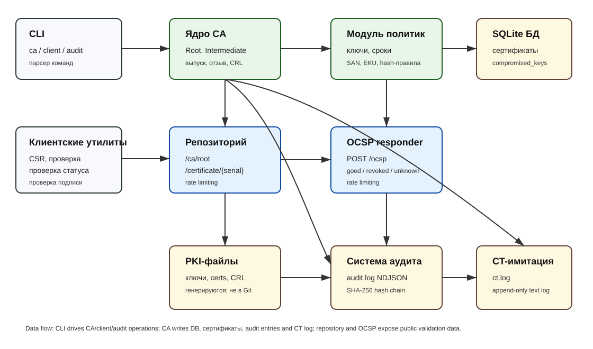

# MicroPKI v1.0.0

MicroPKI is an educational command-line Public Key Infrastructure that creates a Root CA and Intermediate CA, issues X.509 certificates, serves repository and OCSP endpoints, validates chains and revocation status, signs files, and records security-sensitive actions in a tamper-evident audit log.



## Features

- Root CA and Intermediate CA creation with encrypted CA private keys.
- End-entity certificate issuance for `server`, `client`, and `code_signing` templates.
- External CSR processing and client CSR generation.
- Certificate database with certificate status, revocation metadata, CRL numbering, and compromised-key tracking.
- CRL generation and OCSP responder support.
- Repository HTTP service for CA certificates, issued certificates, CRLs, and CSR submission.
- Client-side path validation, purpose/EKU validation, CRL and OCSP status checks.
- Sprint 7 hardening: audit NDJSON, SHA-256 hash chain, CT simulation, policy enforcement, compromise simulation, and rate limiting.
- Sprint 8 deliverables: automated end-to-end demo, TLS demonstration, code-signing demonstration, final documentation, test suite, performance test hook, and CI workflow.

## Prerequisites

- Python 3.8 or newer.
- `cryptography>=41.0.0`.
- `pytest`, `pytest-cov` for tests and coverage.
- OpenSSL CLI is optional. The built-in Sprint 8 demo uses Python TLS and does not require manual OpenSSL commands.

## Installation

```bash
python -m venv .venv
source .venv/bin/activate      # Linux/macOS
# .venv\Scripts\activate       # Windows PowerShell/CMD
python -m pip install -r requirements.txt
python -m pip install -e .
```

After installation, use `micropki`. Without installation, run commands as `python -m micropki` from the repository root.

## Configuration

`micropki` accepts an optional `--config` flag. The default sample is `micropki.toml`; the Sprint 8 demo sample is `demo/micropki.demo.toml`. Configuration can describe audit paths, policy settings, CT log paths, and rate-limit defaults. CLI arguments remain explicit and override normal command defaults.

Generated certificates, keys, databases, CRLs and logs are intentionally ignored by Git. They are created under `pki/` or `demo/_work/` during local runs.

## CLI reference

General form:

```bash
micropki [--config micropki.toml] <group> <command> [options]
```

CA commands:

```bash
micropki ca init --subject "CN=Demo Root CA,O=MicroPKI" --key-type ecc --key-size 384 --passphrase-file secrets/root.pass --out-dir pki --db-path pki/micropki.db --force
micropki ca verify --cert pki/certs/ca.cert.pem
micropki ca issue-intermediate --root-cert pki/certs/ca.cert.pem --root-key pki/private/ca.key.pem --root-pass-file secrets/root.pass --subject "CN=Demo Intermediate CA,O=MicroPKI" --key-type ecc --key-size 384 --passphrase-file secrets/intermediate.pass --out-dir pki --db-path pki/micropki.db
micropki ca issue-cert --ca-cert pki/certs/intermediate.cert.pem --ca-key pki/private/intermediate.key.pem --ca-pass-file secrets/intermediate.pass --template server --subject "CN=localhost,O=MicroPKI" --san dns:localhost --san ip:127.0.0.1 --out-dir pki/certs --db-path pki/micropki.db
micropki ca issue-ocsp-cert --ca-cert pki/certs/intermediate.cert.pem --ca-key pki/private/intermediate.key.pem --ca-pass-file secrets/intermediate.pass --subject "CN=OCSP Responder,O=MicroPKI" --san dns:ocsp.local --out-dir pki/certs --db-path pki/micropki.db
micropki ca verify-chain --root-cert pki/certs/ca.cert.pem --intermediate-cert pki/certs/intermediate.cert.pem --cert pki/certs/localhost.cert.pem --purpose server
micropki ca list-certs --db-path pki/micropki.db --format table
micropki ca show-cert <SERIAL_HEX> --db-path pki/micropki.db
micropki ca revoke <SERIAL_HEX> --reason keyCompromise --force --crl pki/crl/intermediate.crl.pem --ca-cert pki/certs/intermediate.cert.pem --ca-key pki/private/intermediate.key.pem --ca-pass-file secrets/intermediate.pass --db-path pki/micropki.db
micropki ca gen-crl --ca intermediate --out-dir pki --ca-pass-file secrets/intermediate.pass --ca-cert pki/certs/intermediate.cert.pem --ca-key pki/private/intermediate.key.pem --db-path pki/micropki.db
micropki ca check-revoked <SERIAL_HEX> --db-path pki/micropki.db
micropki ca compromise --cert pki/certs/localhost.cert.pem --reason keyCompromise --force --db-path pki/micropki.db --out-dir pki
```

Client commands:

```bash
micropki client gen-csr --subject "CN=app.example.com,O=MicroPKI" --key-type rsa --key-size 2048 --san dns:app.example.com --out-key app.key.pem --out-csr app.csr.pem
micropki client request-cert --csr app.csr.pem --template server --ca-url http://127.0.0.1:8080 --out-cert app.cert.pem
micropki client validate --cert pki/certs/localhost.cert.pem --untrusted pki/certs/intermediate.cert.pem --trusted pki/certs/ca.cert.pem --purpose server --crl pki/crl/intermediate.crl.pem --ca-cert pki/certs/intermediate.cert.pem
micropki client check-status --cert pki/certs/localhost.cert.pem --ca-cert pki/certs/intermediate.cert.pem --ocsp-url http://127.0.0.1:8081/ocsp
micropki client sign --input demo/sample_app.py --key pki/certs/Demo_Code_Signer.key.pem --signature demo/sample_app.py.sig
micropki client verify-signature --input demo/sample_app.py --signature demo/sample_app.py.sig --cert pki/certs/Demo_Code_Signer.cert.pem --trusted pki/certs/ca.cert.pem --untrusted pki/certs/intermediate.cert.pem
```

Server commands:

```bash
micropki repo serve --host 127.0.0.1 --port 8080 --db-path pki/micropki.db --cert-dir pki/certs --crl-dir pki/crl --rate-limit 5 --rate-burst 10
micropki repo status --host 127.0.0.1 --port 8080
micropki ocsp serve --host 127.0.0.1 --port 8081 --db-path pki/micropki.db --responder-cert pki/certs/ocsp.cert.pem --responder-key pki/certs/ocsp.key.pem --ca-cert pki/certs/intermediate.cert.pem --rate-limit 5 --rate-burst 10
```

Audit commands:

```bash
micropki audit query --operation issue --format table --verify --log-file pki/audit/audit.log --chain-file pki/audit/chain.dat
micropki audit verify --log-file pki/audit/audit.log --chain-file pki/audit/chain.dat
micropki audit ct-verify --cert pki/certs/localhost.cert.pem --ct-log pki/audit/ct.log
```

Every command also supports `--help`; the parser lists required arguments and defaults.

## Repository API reference

The repository server is intentionally small and uses plain HTTP.

- `GET /ca/root` returns the Root CA certificate PEM.
- `GET /ca/intermediate` returns the Intermediate CA certificate PEM.
- `GET /certificate/{serial}` returns an issued certificate PEM by serial number.
- `GET /crl?ca=intermediate` or `GET /crl/intermediate.crl` returns a CRL if generated.
- `POST /request-cert?template=server|client|code_signing` accepts a PEM CSR and returns the issued certificate PEM. If `--api-key` is configured, the request must include `X-API-Key`.

The OCSP responder accepts `POST /` or `POST /ocsp` with `Content-Type: application/ocsp-request` and returns a DER OCSP response.

## Demo walkthrough

Run the complete automated demo:

```bash
make demo
# or
python demo/demo.py
```

The script is idempotent. It removes `demo/_work` before starting unless `--keep` is supplied. It performs these steps:

1. Creates passphrase files and the PKI directory structure.
2. Initializes the Root CA and Intermediate CA.
3. Issues server, client, code-signing, and OCSP responder certificates.
4. Starts repository and OCSP servers in the background.
5. Validates the server certificate chain and OCSP status.
6. Starts a real Python TLS server with the MicroPKI-issued server certificate.
7. Proves TLS fails without the Root CA trust anchor and succeeds when the Root CA is supplied.
8. Signs a file with the code-signing certificate and verifies the detached signature.
9. Modifies the file and proves verification fails.
10. Attempts an invalid wildcard server certificate and proves policy enforcement blocks it.
11. Revokes the server certificate, regenerates the CRL, and proves validation fails with revocation checking.
12. Verifies the audit hash chain and CT simulation log.
13. Stops background services.

Expected output uses `[PASS]` after successful positive and expected-negative steps.

## TLS demonstration commands

The demo creates `localhost.cert.pem`, `localhost.key.pem`, and a certificate chain file containing the server certificate plus Intermediate CA. A trust-aware client must supply `pki/certs/ca.cert.pem` as the trust anchor. Without that Root CA, the TLS handshake is expected to fail.

The same result can be reproduced manually with Python or OpenSSL. The important requirement is that the server presents the issued leaf certificate and Intermediate CA, while the client trusts only the MicroPKI Root CA.

After revocation, the TLS transport itself may still complete if the client does not check revocation. `micropki client validate --crl ...` demonstrates the required revocation-aware failure.

## Code-signing demonstration

Code signing uses `micropki client sign` and `micropki client verify-signature`. The signature is detached and binary. Verification checks both the file signature and the certificate chain with the `code_signing` EKU. If a CRL and issuer certificate are provided, the signer certificate must also be non-revoked.

```bash
micropki client sign --input sample_app.py --key pki/certs/Demo_Code_Signer.key.pem --signature sample_app.py.sig
micropki client verify-signature --input sample_app.py --signature sample_app.py.sig --cert pki/certs/Demo_Code_Signer.cert.pem --trusted pki/certs/ca.cert.pem --untrusted pki/certs/intermediate.cert.pem
```

Editing the signed file after signing causes verification to fail.

## Audit system and CT simulation

Audit entries are newline-delimited JSON objects in `pki/audit/audit.log`. Each entry contains timestamp, level, operation, status, message, metadata, and integrity data. Integrity is a SHA-256 hash chain: each entry stores the previous hash and its own canonical JSON hash. `chain.dat` stores the latest chain state.

Use:

```bash
micropki audit verify --log-file pki/audit/audit.log --chain-file pki/audit/chain.dat
micropki audit query --operation issue --format json --verify
```

The CT simulation log is `pki/audit/ct.log`. It is append-only plain text containing timestamp, serial, subject, certificate fingerprint, and issuer. It is a simulation only; it is not a real Merkle-tree CT log.

## Policy enforcement

The CA blocks policy violations before issuance and records them in the audit log. Enforced rules include key sizes, validity windows, SAN restrictions by template, wildcard rejection by default, CSR signature checks, hash/signature algorithm checks, and Intermediate CA path length restrictions.

Examples of blocked requests:

```bash
micropki ca issue-cert ... --template server --san dns:*.example.com
micropki ca issue-cert ... --template server --validity-days 366
```

## Testing and coverage

Run normal tests:

```bash
make test
# equivalent:
python -m pytest -q -k "not perf"
```

Run coverage:

```bash
make coverage
```

Run the 1000-certificate performance test explicitly:

```bash
make perf-test
# equivalent:
MICROPKI_RUN_PERF=1 python -m pytest -q -m perf
```

The normal test suite covers certificate creation, chain validation, expired certificate handling, wrong EKU/purpose handling, malformed inputs, CRL, OCSP, repository endpoints, audit tamper detection, policy violations, CT logging, compromise simulation, TLS integration, and code signing. The performance test is isolated and skipped from normal runs because it intentionally issues and validates 1000 certificates.

## CI

A GitHub Actions workflow is included in `.github/workflows/ci.yml`. It installs dependencies and runs the normal test suite on pushes and pull requests.

## Security considerations

MicroPKI is educational software and is not production-ready without additional hardening.

- End-entity private keys are stored unencrypted by default. Treat generated `*.key.pem` files as secrets.
- Root and Intermediate CA private keys are encrypted, but passphrases are read from files. Protect passphrase files and remove them from shared systems.
- The repository and OCSP responder use HTTP, not HTTPS, unless placed behind a TLS reverse proxy.
- Rate limiting is a local per-IP token bucket; it does not stop distributed attacks.
- The audit log is tamper-evident through a hash chain but is not externally signed or anchored.
- CT is only simulated with a plain text append-only file. It has no Merkle tree, inclusion proof, or public gossip protocol.
- Root/Intermediate lifecycle management, key ceremonies, HSM storage, backup, disaster recovery, and certificate profiles are simplified for coursework.

## Release

The final deliverable version is `v1.0.0` in `pyproject.toml`. After committing the repository, create and push the tag:

```bash
git tag -a v1.0.0 -m "MicroPKI Sprint 8 final deliverable"
git push origin main --tags
```

## References

- RFC 5280: Internet X.509 Public Key Infrastructure Certificate and CRL Profile.
- RFC 6960: Online Certificate Status Protocol.
- Python `cryptography` package documentation.
- Python `ssl`, `http.server`, and `sqlite3` standard-library documentation.
